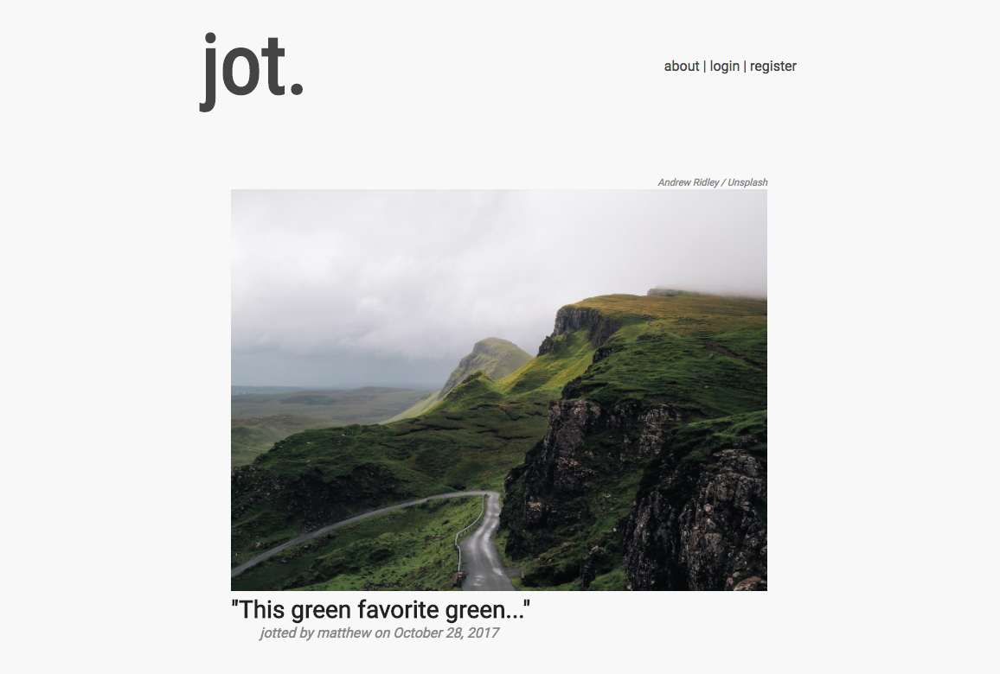

# jot
Jot is a minimalistic writing prompt web app that I made to help myself get back into
writing as a creative outlet. It takes about six minutes to write a new jot.
One minute to look at the picture and follow along with a yoga-based breathing exercise, then five minutes to write something.

Try it out here:

https://promptjot.herokuapp.com/

