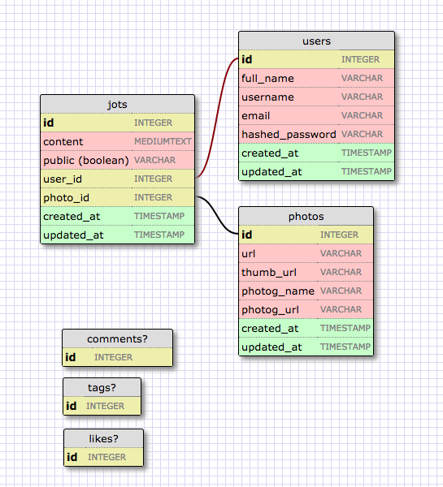

# jot
This will be a beautiful and minimalistic web app to help myself get back into
writing as a creative outlet. It will only take six minutes to write a new jot.
One minute to look at the picture and relax, five minutes to write something.

## Schema:

## To-Dos:
  1. Homepage should be a pretty view of recent public jots.
  2. Upon login, the homepage stays the same, but the nav bar includes a username link and a 'jot' link.
  3. Username link goes to a show page of all the user's jots.
    * users cannot edit jots, but can choose which to make private/public
  4. Jot link goes to jots/new -- remember to follow unsplash guidelines!
    * show an unsplash photo for 60 seconds
    * display textarea below the photo for five minutes
    * display submit button to create the jot

## Read me:
Use #jot-popups on the jots/new.erb page to display "Look."
Fade it out after seconds. (Stretch: Fade out everything but the photo.)
After 60 seconds, fade in "Write." Also fade it out after 60 seconds.
When you fade in "Write.", it'd be cool to fade in and out a #222 1px
border around the textarea.
After 5 minutes of the textarea being active, notify the user that jot
time is up and display a submit button. (Stretch: Also the option to
submit the jot as public or private.)
Also stretch: It'd be cool to make a little dot or something that slowly
fades out over the course of 5 minutes. (Don't even think about touching
this until you've gotten all the goddamn functionality implemented!)

Dummy for jots/new.erb (reduce API calls...)

  

   

    
<a href="https://unsplash.com/@johncobb">John Cobb</a> / <a href="https://unsplash.com/">Unsplash</a>

    
  

  

    <h3>write.look.</h3>
  

  

    <form id="jot-form"  action="/jots" method="post">
      <button id="publish" type="submit"><h3>publish.</h3></button>
      
        <textarea class="unsplashed" id="textarea-border" rows="16" name="content"></textarea>
      
    </form>
  

Actual jots/new.erb:

   

    
<a href="<%= @photo.photog_url %>"><%= @photo.photog_name %></a> / <a href="https://unsplash.com/">Unsplash</a>

    ">
  

  

    <h3>write.look.</h3>
  

  

    <form id="jot-form"  action="/jots" method="post">
      <button id="publish" type="submit"><h3>publish.</h3></button>
      
        <input type="hidden" name="photo" value="<%= @photo.id %>">
        <textarea class="unsplashed" id="textarea-border" rows="16" name="content"></textarea>
      
    </form>
  

